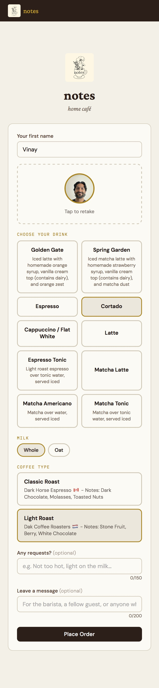
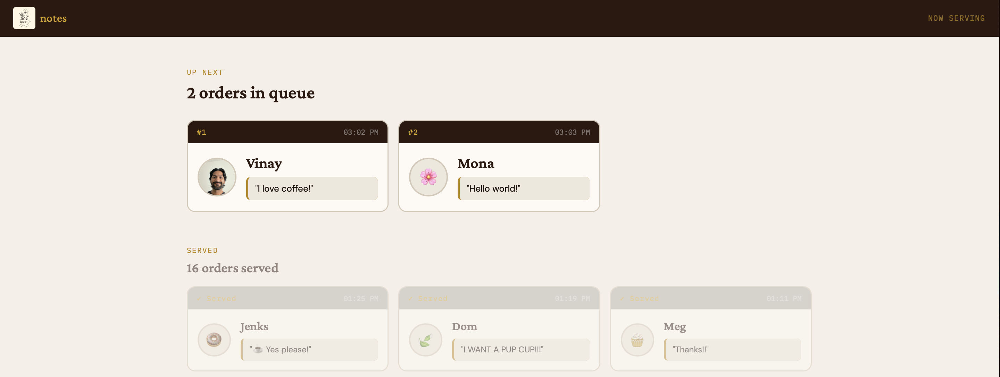
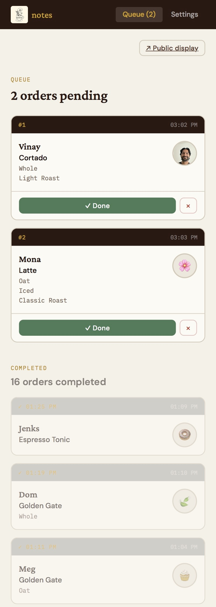
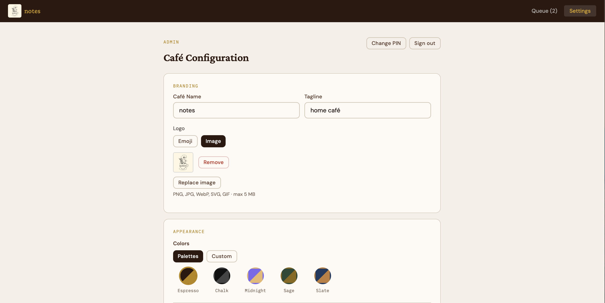
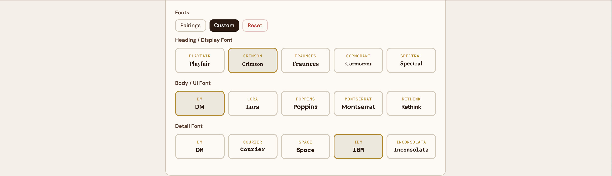
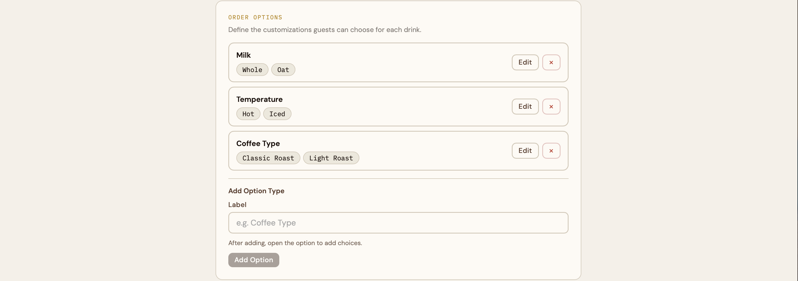
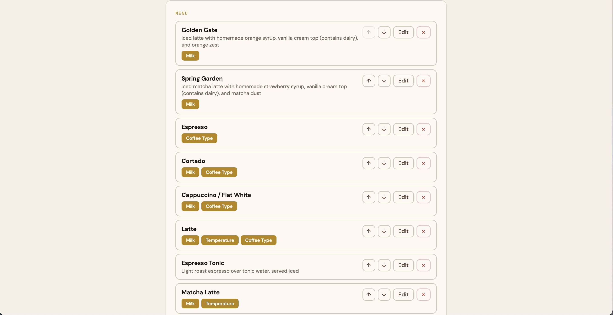
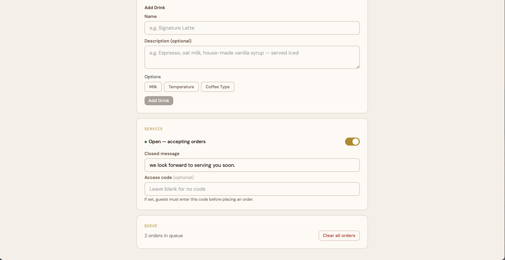

# Common Grounds: Lightweight Café Order System

Common Grounds is a lightweight, fully-functional café order system that turns your home café or pop-up into a polished, connected experience. Guests order from their phones, you manage a real-time queue on yours, and a public display screen keeps everyone in the loop.

Common Grounds is *perfect* for:
- Home cafés and coffee enthusiasts hosting friends
- Small pop-ups and intimate events
- Anyone who wants to add a little structure and fun to serving drinks

Common Grounds is *not intended* for commercial café environments requiring:
- Payments integrated into the order experience
- Handling of high order volume
- Strong security features

Common Grounds was designed and built entirely in conversation with [Claude](https://claude.ai) by Anthropic. It started as a personal project for my own home café. Coming from a software and product background, I decided I wanted to make it really easy for others to use and customize it to their needs with no additional code or AI required.

The code in this repo has been deployed in my own home café with [Vercel](https://vercel.com) as the hosting service and [Firebase Realtime Database](https://firebase.google.com/products/realtime-database) for storing and syncing data. Simple steps for setting up the app using Vercel and Firebase are outlined later on this page, but you may substitute other services if you prefer.

If Common Grounds made your home café a little more fun, consider [buying me a coffee](https://buymeacoffee.com/vinaysatish) ☕

---

## Features

### Guest experience
- Mobile-friendly order form with your custom menu and web styling
- Optional photo capture visible to the barista and on the public queue
- Easy selection of preset drink options (e.g. temperature, milk type, etc.)
- Optional freeform text field to post a message to the public queue

<div align="center"></div>

### Public queue display (`/#/queue`)
- A read-only screen to display on a TV or spare monitor
- Shows who's up next with names, photos, and messages
- "Served" section shows completed orders

<div align="center"></div>

### Admin panel (`/#/admin`)
The admin panel is PIN-protected and contains two tabs: **Queue** and **Settings**.

**Queue tab (barista view):**
- Real-time order queue with name, photo, and drink details
- Mark orders done or remove them
- Completed orders section for reference

<div align="center"></div>

**Settings tab (café configuration):**
- Change the admin panel PIN
- Café branding: name, tagline, emoji or image logo
- Rich appearance customization: choose from five color palettes or build a custom color scheme, five curated font pairings or mix and match individually
- Full menu management: add, edit, reorder drinks with descriptions and per-drink options
- Define custom order options (e.g. Milk, Temperature, Coffee Type, etc.) with names and descriptions per choice
- Open/close the café, customize the closed message, set an optional guest access code
- Clear all orders when the event wraps

<div align="center">





</div>

---

## Getting started

### Prerequisites

- A GitHub account
- A [Firebase](https://firebase.google.com/) account (free Spark plan is sufficient)
- A [Vercel](https://vercel.com/) account (free tier is sufficient)

---

### 1. Fork this repo

1. Click **Fork** in the top right of this page
2. This creates your own copy of the project under your GitHub account

---

### 2. Set up Firebase

1. Go to [console.firebase.google.com](https://console.firebase.google.com) and create a new project
2. In the left sidebar, go to **Build → Realtime Database** and create a database
3. Choose a region and start in **test mode**
4. Go to **Project Settings → Your apps** and register a web app
5. Copy the `firebaseConfig` values. You'll need them in the next step
6. Set your Firebase rules to:

```json
{
  "rules": {
    ".read": true,
    ".write": true
  }
}
```

> ⚠️ These rules are intentionally open for ease of setup. See [Security](#security) for context.

---

### 3. Configure environment variables

1. Go to [vercel.com](https://vercel.com) and sign in with your GitHub account
2. Click **Add New Project** and import your forked repository
3. Before deploying, open **Environment Variables** and add the following using the values from your Firebase config:

| Variable | Firebase config field |
|---|---|
| `VITE_FIREBASE_API_KEY` | `apiKey` |
| `VITE_FIREBASE_AUTH_DOMAIN` | `authDomain` |
| `VITE_FIREBASE_DATABASE_URL` | `databaseURL` |
| `VITE_FIREBASE_PROJECT_ID` | `projectId` |
| `VITE_FIREBASE_STORAGE_BUCKET` | `storageBucket` |
| `VITE_FIREBASE_MESSAGING_SENDER_ID` | `messagingSenderId` |
| `VITE_FIREBASE_APP_ID` | `appId` |

---

### 4. Deploy to Vercel

Click **Deploy**. Vercel will build and host your app automatically. Any changes you push to your forked repo will trigger a new deployment.

Your app will be live at `your-app.vercel.app`.

| URL | Description |
|-----|-------------|
| `your-app.vercel.app/` | Guest order form |
| `your-app.vercel.app/#/admin` | Admin panel: Queue and Settings tabs (PIN protected) |
| `your-app.vercel.app/#/queue` | Public queue display |

---

## First-time setup

1. Navigate to `/#/admin`
2. You'll be prompted to set a 4-digit admin PIN. Keep this safe
3. Go to **Settings** to configure your café name, logo, menu, and options
4. Toggle the café **Open** when you're ready to accept orders
5. Optionally set a guest **access code** in the Service section

---

## Security

Common Grounds includes basic security features appropriate for casual home events:

- **Admin PIN:** hashed with SHA-256, stored locally per device; required to access queue and settings
- **Guest access code:** optional code guests must enter before ordering
- **Route separation:** guest, admin, and queue views are on separate routes

These are not designed to be bulletproof. The Firebase rules above allow open read/write access, which is fine for a private home event, but not appropriate for a public-facing commercial deployment. See [Firebase security rules documentation](https://firebase.google.com/docs/database/security) if you want to tighten them.

---

## Contributing

Contributions are welcome. If you find a bug, have a feature idea, or want to improve the code:

1. Open an issue to discuss before building
2. Fork the repo and create a branch
3. Submit a pull request with a clear description

Please keep the spirit of the project in mind: lightweight, approachable, and designed for casual use.

---

## License

[MIT](LICENSE) © [Vinay Satish](https://github.com/vinaysatish)
